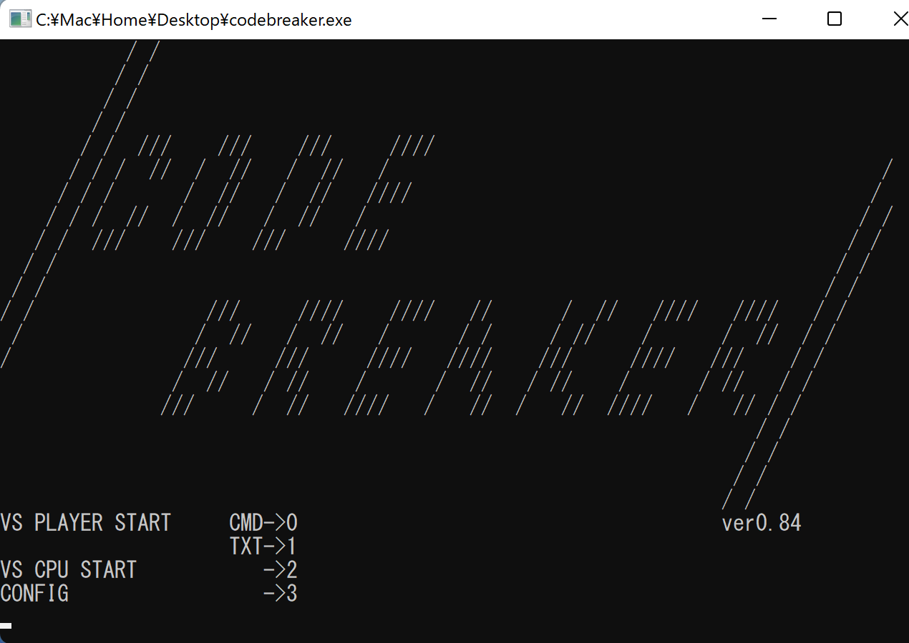
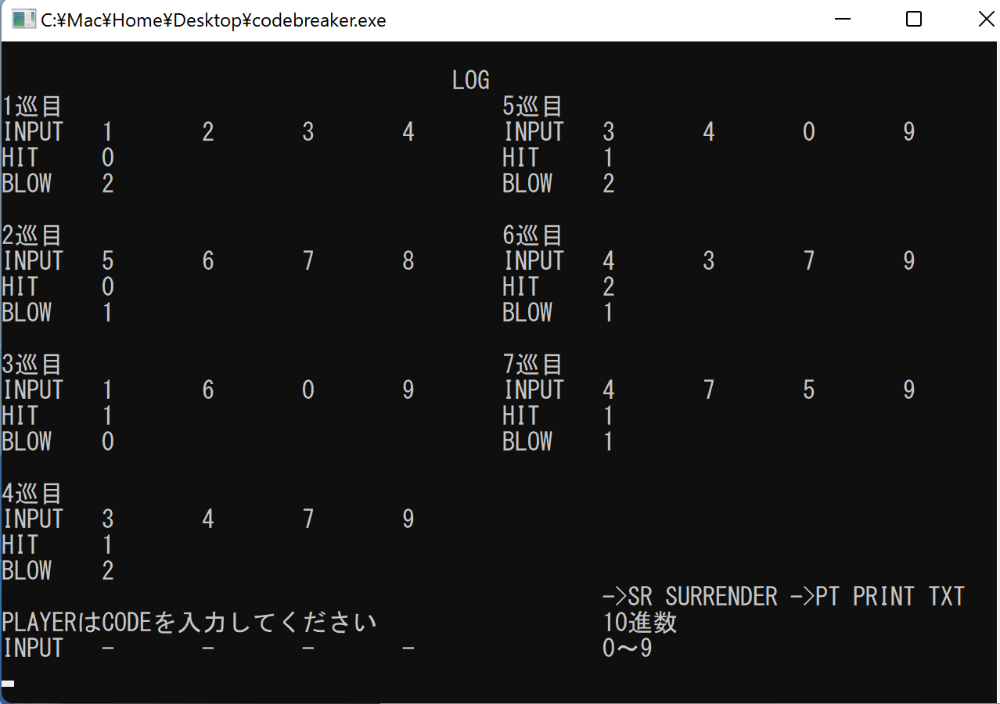
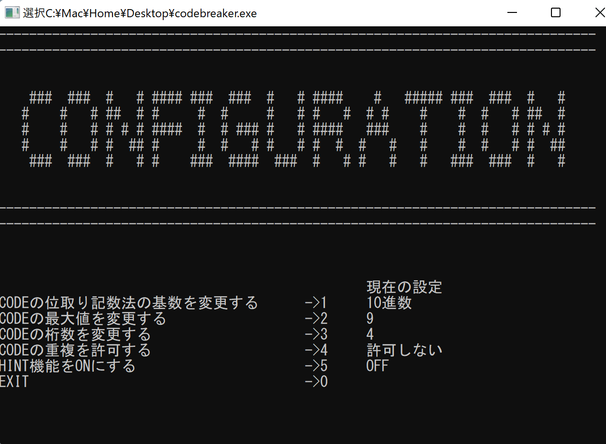
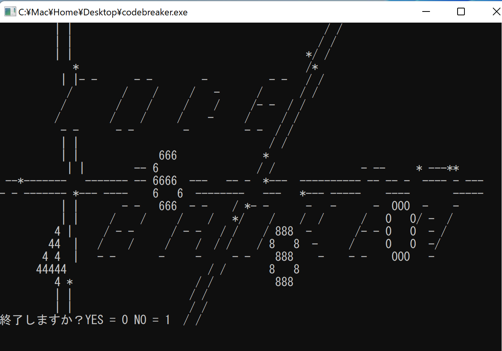

# CODE BREAKER
## C言語（exe）

 

右も左も分からぬままBorlandのCコンパイラで作成したゲームです。 
ゲームの名前は「CODE BREAKER」、Hit＆Blowという名前でも知られているゲームで、 
某RPGのミニゲームで出会い、単純で面白かったという思い出がありました。

 

 

荒ぶるポインタに翻弄されながらもなんとか形になった時は我ながら感動したものです。 
ファイル一枚で構成されている（千行くらいある）、既にある関数を車輪の再発明している、 
など多く至らない点がありながらもtxtファイルを用いて対人戦もできる他、10進数以外にも対応していたりとしっかりと遊べるように仕上がっていたと思います。 
