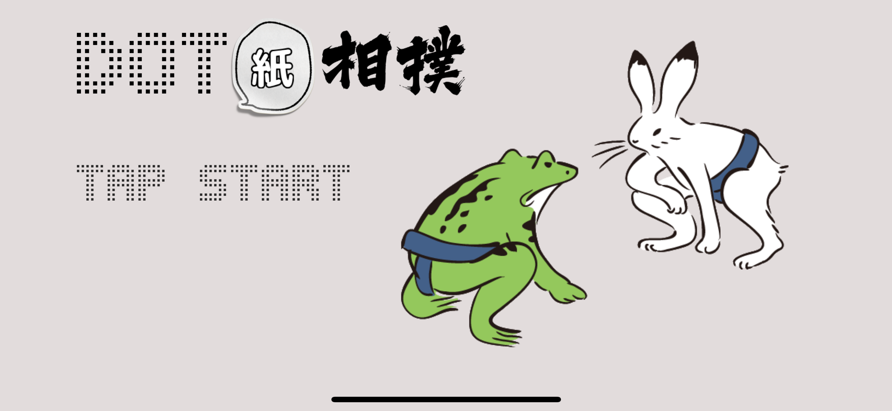
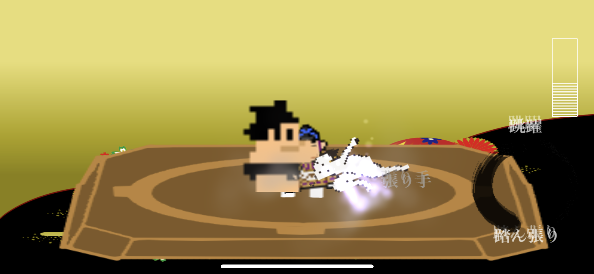
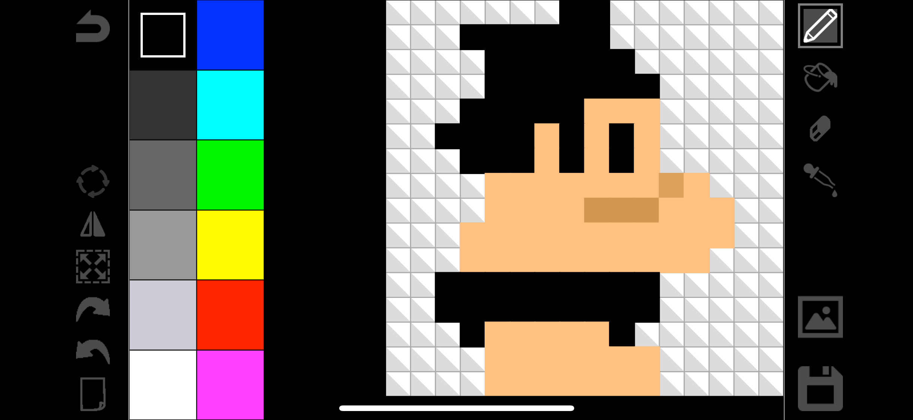

# Dot紙相撲
## iOS
 

 

ほぼ連打するだけの単純なゲームです。
単純なゲームなら受けるのではないか？
親世代にとってノスタルジーもあり子供にも遊んでもらえるのではないか？との思いから生まれたゲームです。 
技術的にはFirebaseを使用していてネット対戦が可能でした。
MultiPeerConnectivityが上手く扱い切れずBlueTooth対戦はオミットしての公開になってしまったのが心残りです。

 

 

ドット絵同士で紙相撲のように戦わせるゲームなのですが、プリセット画像だけとか、単に画像をインポートできるだけではアプリとして完結していないのではないか？
との思いがありドットを描くツールも付属しています。