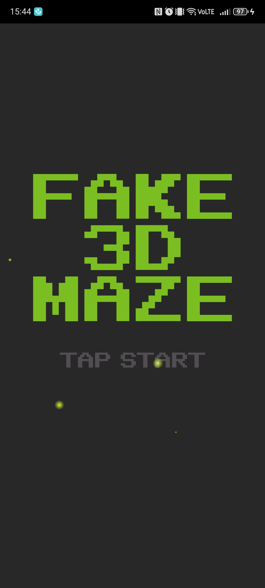
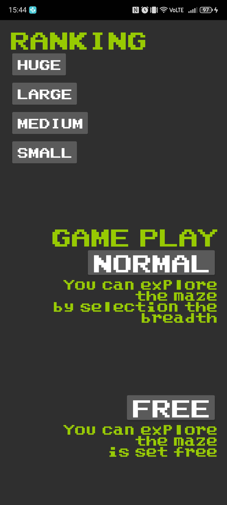
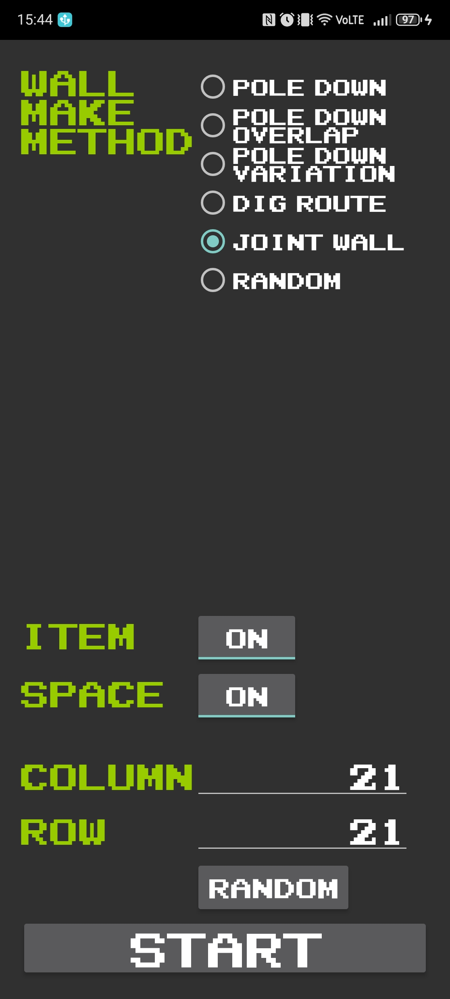
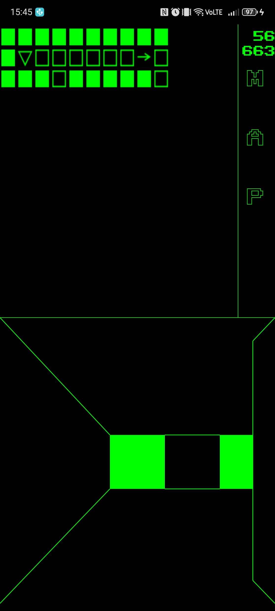

# FAKE3DMAZE
## Android

 

某RPGみたいな3D迷路を探索するアプリを作りたい！との思いから生まれたアプリです。
迷路の壁配置のアルゴリズムやスタートからゴールまでの道筋を描くアルゴリズムなど
迷路作成アルゴリズムのサイトを見ながら試行錯誤していました。
再帰的なプログラムが多く、よくスタックして当時はまだビルド時間が結構かかっていたので苦労しました・・・

ちなみに下の画像が実際のプレイ画面ですが擬似的に３Dぽく見えているだけで処理的には根性系です

 

