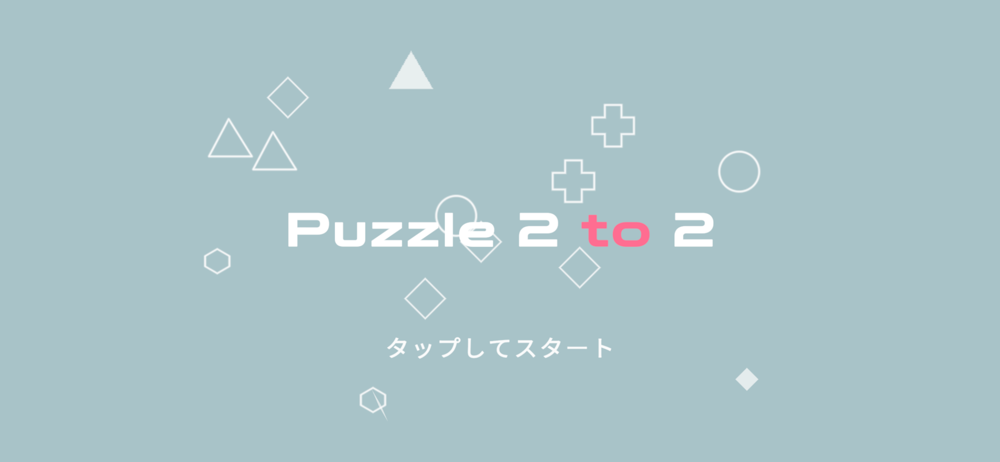

# PUZZLE 2 TO 2

「PUZZLE 2 TO 2」 は、シンプルなルールの中に奥深い戦略性を秘めた思考型ゲームです。 
全てのゴールを埋めるために、壁やワープ、移動する障害物など多彩なギミックを読み解き、最適なルートを導き出してください。

ゲームの特徴
-	ルールはシンプル、しかし攻略は一筋縄ではいかない
-	直感と論理を駆使してゴールをすべて制覇
-	仕掛けの異なる多彩なステージ構成
-	思考力・ひらめき力を鍛えたい方に最適

パズルを極めたいあなたに捧ぐ、新しい挑戦。

[プライバシーポリシー](./privacy_policy.md) 
[利用規約](./term_of_use.md)