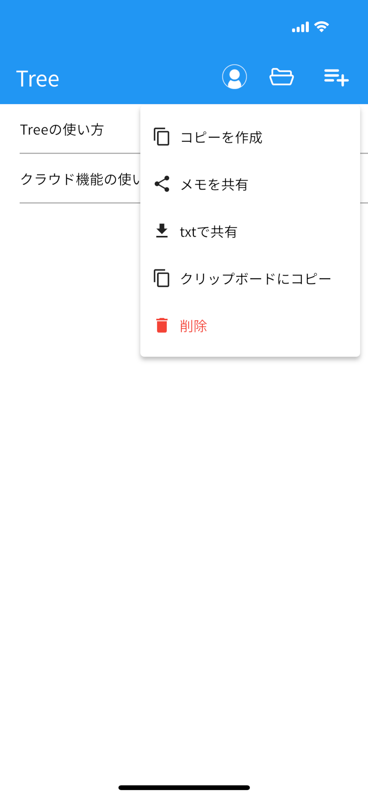
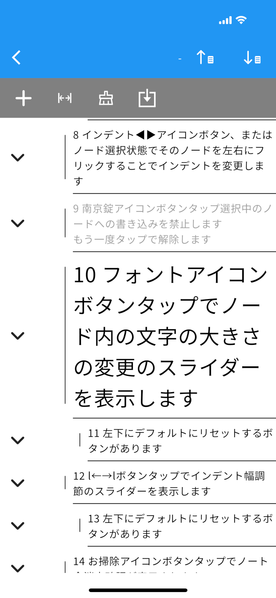

# Tree-BranchNote

  
  

Tree-BranchNoteは、思考やアイデアを「枝分かれ」させながら整理できるメモアプリです。
日常のメモから、複雑なプロジェクト管理、学習ノートまで、あらゆる情報を階層構造で管理できます。

【こんな方におすすめ】
• 思考を整理しながらアイデアを広げたい方
• プロジェクトやタスクを階層的に管理したい方
• 学習内容を体系的にまとめたい学生・研究者
• 読書メモや議事録を構造化して保存したい方
• マインドマップのようにメモを整理したい方

【主な機能】

▼ツリー構造での情報整理
- インデントを調整して階層構造を自由に作成
- 折りたたみ機能で大きなメモもスッキリ表示
- ドラッグ&ドロップで直感的に項目を移動

▼豊富な編集機能
- フォントサイズの行ごと調整
- インデント幅のカスタマイズ
- 読み取り専用モードで誤編集を防止
- 行の上下移動で素早く整理

▼クラウド同期
- Google Sign InまたはApple Sign Inで簡単ログイン
- Firebase連携で複数デバイス間でメモを同期
- 自動バックアップで大切なメモを守る

▼ファイル管理
- メモごとにファイルとして管理
- ファイル名の変更・コピー・削除が簡単
- テキスト形式でのエクスポート対応
- ファイル共有機能でメモを他のアプリと連携

▼使いやすいデザイン
- シンプルで直感的なUI
- ダークモードに対応

【使い方】

1. アプリを起動してチュートリアルを確認
2. 新規メモを作成して、思いついたことを入力
3. インデントボタンでメモを階層化
4. 折りたたみ機能で見やすく整理
5. クラウドにバックアップして、どこでもアクセス

【TreeMemo-BranchNoteの特長】

◆思考の可視化
単なるメモではなく、「考えの枝分かれ」を表現できます。
アイデアを出しながら、同時に整理できるのが最大の特長です。

◆柔軟な構造
ToDoリストのような単純なリストから、プロジェクト管理のような複雑な階層まで、
自由自在に表現できます。

◆プライバシー重視
ログインなしでローカルで使用可能。
クラウド同期は任意で、自分のペースで使えます。

【こんな使い方ができます】

プロジェクト管理
　プロジェクト > タスク > サブタスク という階層で管理

学習ノート
　科目 > 単元 > ポイント > 詳細 と構造化

読書メモ
　本のタイトル > 章 > 重要なポイント > 感想

議事録
　会議名 > 議題 > 決定事項 > アクションアイテム

レシピ管理
　料理名 > 材料 > 手順 > コツ

旅行計画
　旅行名 > 日程 > 場所 > やること

【開発者からのメッセージ】

Tree-BranchNoteは、「思考を整理する」ことの楽しさを提供したいという想いから生まれました。
メモは単なる記録ではなく、思考のプロセスそのものです。
このアプリが、あなたの創造性を引き出し、日々の生活や仕事をより豊かにする手助けとなれば幸いです。

【サポート】
ご質問やご要望がございましたら、お気軽にお問い合わせください。
皆様のフィードバックをもとに、より良いアプリにしていきます。

---

Tree-BranchNoteで、あなたの思考を自由に広げましょう。

[プライバシーポリシー](./privacy_policy.md) 
[利用規約](./term_of_use.md) 

Contact 
[tree.branch.note@gmail.com](tree.branch.note@gmail.com)